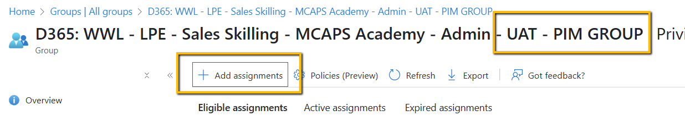

# **PIM Enabled – D365 Admin Access**

**Just in time access for Power Platform**

**v2.0**

# Overview

Use Privileged Identity Management (PIM) to manage, control, and monitor
access within your Microsoft Entra organization. With PIM you can
provide as-needed and just-in-time admin access to Power platform
environment.

The idea is for users to raise PIM access to receive system
administrator permissions on the power platform environment without the
need to have permanent privileged access.

This article describes how to set up Privileged Identity Management
(PIM) with power platform environment and get started using it

# Contents

- Overview - [2](#overview)

- Prerequisites - [2](#prerequisites)

- Architecture - [3](#architecture)

  - Azure Set up - [4](#azure-set-up)

  - Group Set up - [4](#group-set-up)

  - Access package Set up - [6](#access-package-set-up)

- D365 Set up - [7](#d365-set-up)

  - Team Set up - [7](#team-set-up)

  - Solution Install - [8](#solution-install)

- Throttling Limits - [10](#throttling-limits)

- Known issue - [10](#known-issue)

# Prerequisites

- User requesting access to be part of the Security group that drives
  the power platform environment.

- Two Azure Security groups per power platform environment.

  - Create / Request new Security group using Azure Portal
  - Sample group names are as below. Please use the appropriate naming

    > D365: WWL - LPE - Sales Skilling - MCAPS Academy - Admin – UAT (
    > referred as **Group 1** in document)
    >
    > D365: WWL - LPE - Sales Skilling - MCAPS Academy - Admin - UAT - PIM
    > GROUP (referred as **Group 2** in document)

- Identity Governance – Catalog access

  - Access to create new Access packages

- Power platform admin access

  - Non-people account with System administrative access to set up Power
    platform Teams and to Import solution.

# Architecture

- Users request access via the Access package, allowing them to be
  eligible to raise PIM access.

- Once access request approved, users can activate and obtain the system
  admin role in the Power Platform environment through PIM access.

> 

# Azure Set up

## Group Set up

- Navigate to Azure =\> Groups

- Search for D365: WWL - LPE - Sales Skilling - MCAPS Academy - Admin -
  UAT - PIM GROUP (Group 2)

- Enable PIM for this group. (Group 2)

> 

- Once the PIM is enabled for D365: WWL - LPE - Sales Skilling - MCAPS
  Academy - Admin - UAT - PIM GROUP (Group 2). Click on Add Assignment.

> 

- Select Role as **Member**, and Selected Member as **D365: WWL - LPE -
  Sales Skilling - MCAPS Academy - Admin – UAT** (Group 1).

> 

- Click Next

- Select Assignment Type as **Eligible**

> 

- Click Assign

- Once completed, it should look like
  this

> 

## Access package Set up

- Navigate to Azure =\> Identity Governance =\> Catalogs

- Select an appropriate catalog to create an access package.

- Click **New access package**

- Provide name and description of the access package, and navigate to
  Resource roles

> 

- Select **Group and Teams**, Click on **See all Groups** and search and
  select D365: WWL - LPE - Sales Skilling - MCAPS Academy - Admin – UAT
  (**Group 1**)

> 

- Continue creation of access package. For sample access package refer
  [this](https://learn.microsoft.com/en-us/entra/id-governance/entitlement-management-access-package-create).

- Once the access package is created, My Access portal link and be used
  to request to be eligible to request PIM access for system
  administrator role for Power platform environment

> 

# D365 Set up

## Team Set up

- Navigate to Admin power platform portal =\> Select Environment

- Select Teams =\> Create Team

- Enter team name as **D365: WWL - LPE - Sales Skilling - MCAPS Academy -
  Admin - UAT - PIM GROUP (Group 2)**

- Select appropriate **Business Unit** and **Team administrator**

- Choose team type as **Microsoft Entra ID Security Group**

- Group name: **D365: WWL - LPE - Sales Skilling - MCAPS Academy -
  Admin - UAT - PIM GROUP (Group 2)**

- Membership type: **Members**

- Select Next

- Assign "**System administrator**" role for this team.

- Once the team is created, click on the team name, this will open a
  window.

> 

- Copy the id values from the query string, this will be required to set
  up environment variables during solution deployment.

> 

## Solution Install

**Problem:**

As per the
[documentation](https://learn.microsoft.com/en-us/power-platform/admin/manage-group-teams#about-group-teams),
once the user logs in to environment, the Microsoft Entra group
membership is cached, and it does not reflect any chances until the
users logs in again or when the system refreshed the cache (after 8
hours of continuous log in).

**Solution:**

To mitigate this, there is a power automate created that trigger on when
a team member is added or removed from the security group, and it forces
sync user and team membership of the AAD security group. This API is
provided by Power platform for admin connectors.

**Install Solution.**

- Download the **LPEPIMAccess_1_0_0_0_managed.zip** managed solution from "**solution**" folder
- Login to <https://make.preview.powerapps.com/> portal with Non-People
  account with system administrator access

- Select your environment =\> Solutions =\> Import Solutions

- Select the download zip file

- Select Next

- Set up the required connection references

>  alt="A screenshot of a computer AI-generated content may be incorrect." />

- Set up environment variables.

  - Environment id – Fetch the environment id from Admin portal for the
    current environment where the solution is deployed

  - PIM enabled team id – Enter the ID copied in previous step

  - PIM Enabled Azure Group id – Fetch Azure group id from Azure portal
    for **D365: WWL - LPE - Sales Skilling - MCAPS Academy - Admin -
    UAT - PIM GROUP** (Group 2)

> 

- Click Import.

- Once the import is successfully completed, verify if the power
  automate is in enabled status.

This completes the set up.

# Throttling Limits

There is a throttling limit for using the power platform for admin
API’s. Refer the
[documentation](https://learn.microsoft.com/en-us/connectors/powerplatformforadmins/#limits)
for details.

The throttling limit to enable PIM request is based on Power platform
for admin API’s limit.

| Name               | Calls | Renewal Period |
| ------------------ | ----- | -------------- |
| Enable PIM Request | 50    | 60 seconds     |

# Known issue

- Once the PIM request is raised, it can take up to 5 mins for access to
  be available.

- If access is unavailable, it is recommended to sign out from the
  browser and login in again.
